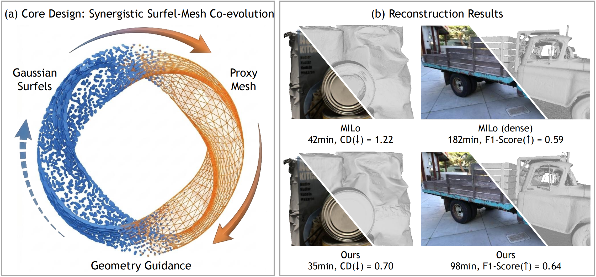

<h1 align="center">TopoSurfel: Closing the Loop between Gaussian Surfels and Meshes for Surface Reconstruction</h1>

<h3 align="center">SIGGRAPH Asia 2026 (TOG)</h3>

<p align="center">
  Chuanjin Fan, Wenjie Chang, Bohao Liao, Yujia Chen, Wenfei Yang, and Tianzhu Zhang
</p>

<p align="center">
  University of Science and Technology of China
</p>

<p align="center">
  <a href="https://arxiv.org/abs/2608.20687"></a>
  <a href="https://fan-treasure.github.io/TopoSurfel_page/"></a>
  <a href="https://www.youtube.com/watch?v=PAG5X6h7xYI"></a>
</p>

<p align="center">
  
</p>

TopoSurfel is a surface reconstruction framework that tightly couples Gaussian surfels with a differentiable proxy mesh. This closed-loop co-evolution brings global geometric guidance into 3D Gaussian splatting, suppressing floaters, filling holes, and improving reconstruction accuracy across diverse scenes while retaining efficient training and high-quality rendering.

## 🌀 Pipeline

TopoSurfel uses a two-stage reconstruction pipeline:

1. **Initial mesh generation.** We run [PGSR](https://github.com/zju3dv/PGSR) and extract a coarse mesh named `mesh_init.ply`. For large scenes, we also retain the PGSR point cloud as background initialization.
2. **TopoSurfel optimization.** We initialize Gaussian surfels from the coarse mesh and jointly optimize the surfels and a differentiable proxy mesh. The final surface is extracted from the optimized representation.

The initial mesh is required. Before starting TopoSurfel training, every scene directory must contain:

```text
<scene>/
└── mesh_init.ply
```

Mip-NeRF 360 and Tanks and Temples initialization scripts additionally create:

```text
<scene>/
└── PGSR_pretrained/
    ├── point_cloud.ply
    └── cfg_args
```

TopoSurfel uses this point cloud as optional background initialization for scene-level meshes.

## ⚙️ Installation

Create a Conda environment and install PyTorch:

```bash
conda create -n toposurfel python=3.10 -y
conda activate toposurfel

pip install torch==2.5.1 torchvision==0.20.1 \
    --index-url https://download.pytorch.org/whl/cu121
```

Install the Python dependencies:

```bash
pip install -r requirements.txt
```

Install the CUDA-dependent packages separately. The commands below are for the tested PyTorch 2.5.1 / CUDA 12.1 configuration:

```bash
pip install git+https://github.com/NVlabs/nvdiffrast.git --no-build-isolation
pip install git+https://github.com/facebookresearch/pytorch3d.git@v0.7.9 --no-build-isolation
pip install kaolin==0.18.0 \
    -f https://nvidia-kaolin.s3.us-east-2.amazonaws.com/torch-2.5.1_cu121.html

pip install submodules/diff-plane-rasterization --no-build-isolation
pip install submodules/simple-knn --no-build-isolation
```

If you use another PyTorch or CUDA version, install matching builds of PyTorch3D and [Kaolin](https://kaolin.readthedocs.io/en/stable/notes/installation.html). A working CUDA compiler must be available when building the rasterizer and KNN extensions.

## 📦 Data Preparation

The following datasets are supported:

- [DTU](https://roboimagedata.compute.dtu.dk/?page_id=36): we use the preprocessed version provided by [2D Gaussian Splatting](https://surfsplatting.github.io/). Download the official evaluation point clouds and observation masks separately.
- [Tanks and Temples](https://www.tanksandtemples.org/download/): download the images, ground-truth point clouds, COLMAP trajectories, transformations, and crop files.
- [Mip-NeRF 360](https://jonbarron.info/mipnerf360/): use the official dataset.
- [NeRF-Synthetic](https://www.matthewtancik.com/nerf): use the official synthetic dataset.

Organize the data under `workdir/`:

```text
workdir/
├── DTU/
│   ├── scan24/
│   │   ├── images/
│   │   ├── mask/
│   │   ├── sparse/
│   │   ├── cameras.npz
│   │   └── cameras_sphere.npz
│   ├── ...
│   ├── ObsMask/
│   └── Points/
│       └── stl/
├── TNT/
│   ├── Barn/
│   ├── Caterpillar/
│   ├── Courthouse/
│   ├── Ignatius/
│   ├── Meetingroom/
│   └── Truck/
├── mipnerf360/
│   ├── bicycle/
│   ├── bonsai/
│   └── ...
└── nerf_synthetic/
    ├── chair/
    ├── drums/
    └── ...
```

### DTU preprocessing

The released 2DGS-format DTU data can be used directly. If starting from the original DTU data, install [COLMAP](https://colmap.github.io/) and run:

```bash
python scripts/preprocess/convert_dtu.py --dtu_path workdir/DTU
```

### Tanks and Temples preprocessing

Each scene must initially contain `images_raw/`, `<scene>_COLMAP_SfM.log`, `<scene>_trans.txt`, and the official ground-truth assets. Then run:

```bash
python scripts/preprocess/convert_tnt.py --tnt_path workdir/TNT
```

## 🚀 Quick Start

The example below reconstructs DTU scan 24.

### 1. Generate the initial mesh with PGSR

Run the PGSR stage from the `PGSR/` directory because its scripts use paths relative to that directory:

```bash
cd PGSR
```

Select scan 24 and set `gpu_id` in `scripts/init_dtu.py`, then run:

```bash
python scripts/init_dtu.py
cd ..
```

The initialization stage writes:

```text
workdir/DTU/scan24/mesh_init.ply
```

### 2. Train TopoSurfel

```bash
CUDA_VISIBLE_DEVICES=0 python train.py \
    -s workdir/DTU/scan24 \
    -m output_dtu/dtu_scan24/test \
    --quiet -r2 --ncc_scale 0.5
```

### 3. Extract the final mesh

```bash
OMP_NUM_THREADS=4 CUDA_VISIBLE_DEVICES=0 python render.py \
    -m output_dtu/dtu_scan24/test \
    --quiet --num_cluster 1 --voxel_size 0.002 --max_depth 5.0
```

The final post-processed mesh is saved to:

```text
output_dtu/dtu_scan24/test/mesh/tsdf_fusion_post.ply
```

### 4. Evaluate

```bash
CUDA_VISIBLE_DEVICES=0 python scripts/eval_dtu/evaluate_single_scene.py \
    --input_mesh output_dtu/dtu_scan24/test/mesh/tsdf_fusion_post.ply \
    --scan_id 24 \
    --output_dir output_dtu/dtu_scan24/test/mesh \
    --mask_dir workdir/DTU \
    --DTU workdir/DTU
```

## 📊 Reproducing the Paper Results

The provided scripts run initialization, TopoSurfel training, mesh extraction, and evaluation for all benchmark scenes.

> [!WARNING]
> The scripts contain dataset paths, output paths, and a `gpu_id` variable near the top of each file. Update these values before running. The scripts also remove the contents of their configured output directories.

### DTU

```bash
cd PGSR
python scripts/init_dtu.py
cd ..

python scripts/run_dtu.py
```

The DTU script evaluates the post-processed mesh using Chamfer Distance.

### Tanks and Temples

```bash
cd PGSR
python scripts/init_tnt.py
cd ..

python scripts/run_tnt.py
```

The Tanks and Temples script evaluates the reconstructed mesh using the official F-score protocol.

### Mip-NeRF 360

```bash
cd PGSR
python scripts/init_mip360.py
cd ..

python scripts/run_mip360.py
```

The script trains all nine scenes, extracts meshes, and reports PSNR, SSIM, and LPIPS for novel-view synthesis.

### NeRF-Synthetic

```bash
cd PGSR
python scripts/init_nerf.py
cd ..

python scripts/run_nerf.py
```

The script trains all eight synthetic scenes, extracts meshes, and reports novel-view synthesis metrics.

## 🧩 Custom Dataset

TopoSurfel accepts the standard COLMAP format used by 3D Gaussian Splatting:

```text
<scene>/
├── images/
├── sparse/
│   ├── cameras.bin
│   ├── images.bin
│   └── points3D.bin
└── mesh_init.ply
```

For an uncalibrated image collection, place the images in `<scene>/input/` and run:

```bash
python scripts/preprocess/convert.py --data_path <parent-directory>
```

Generate a coarse mesh with PGSR or another reconstruction method and save it as `<scene>/mesh_init.ply`. The mesh must contain triangular faces and use the same world coordinate system as the cameras.

Train and extract the surface with:

```bash
python train.py -s <scene> -m <output>
python render.py -m <output> --voxel_size 0.01 --max_depth 10.0
```

## 🛠️ Important Options

| Option | Default | Description |
|---|---:|---|
| `--iterations` | `10000` | Number of TopoSurfel optimization iterations. |
| `--mesh_from_iter` | `1000` | Iteration at which in-loop proxy-mesh reconstruction starts. |
| `--grid_res_in_the_loop` | `360` | DPSR grid resolution used during optimization. |
| `--mesh_opacity_threshold` | `0.05` | Opacity threshold for selecting surfels for mesh reconstruction. |
| `--mesh_depth_weight` | `0.05` | Weight of mesh-depth consistency. |
| `--mesh_normal_weight` | `0.0` | Weight of mesh-normal consistency. |
| `--no_surface_prior` | disabled | Disable the support prior derived from the initial mesh. |
| `--use_cut_points_for_mesh` | disabled | Include cut points when constructing the proxy mesh. |
| `--data_device` | `cuda` | Store input images on `cuda` or `cpu`. |
| `--voxel_size` | `0.002` | TSDF voxel size used by `render.py` for final extraction. |
| `--max_depth` | `5.0` | Maximum fusion depth used by `render.py`. |
| `--use_depth_filter` | disabled | Enable multi-view depth filtering during final extraction. |

All options defined in `arguments/__init__.py` can be passed directly to `train.py`. Dataset-specific extraction settings are provided in the scripts under `scripts/`.

## 📜 License

This project is released under the terms in [LICENSE.md](LICENSE.md). Some components are derived from or depend on separately licensed projects; their original licenses continue to apply.

## 🙏 Acknowledgements

This codebase builds upon [3D Gaussian Splatting](https://github.com/graphdeco-inria/gaussian-splatting) and [PGSR](https://github.com/zju3dv/PGSR). It also uses ideas or software from [2D Gaussian Splatting](https://surfsplatting.github.io/), [Gaussian Opacity Fields](https://github.com/autonomousvision/gaussian-opacity-fields), [MILo](https://github.com/Anttwo/MILo), [DPSR](https://github.com/autonomousvision/shape_as_points), [DISO](https://github.com/SarahWeiii/diso), [nvdiffrast](https://github.com/NVlabs/nvdiffrast), [PyTorch3D](https://github.com/facebookresearch/pytorch3d), and [Kaolin](https://github.com/NVIDIAGameWorks/kaolin).

The DTU and Tanks and Temples evaluation code is adapted from [DTUeval-python](https://github.com/jzhangbs/DTUeval-python) and the [Tanks and Temples evaluation toolbox](https://github.com/isl-org/TanksAndTemples).

## 📝 Citation

If you find this work useful, please cite:

```bibtex
@article{fan2026toposurfel,
  title   = {TopoSurfel: Closing the Loop between Gaussian Surfels and Meshes for Surface Reconstruction},
  author  = {Fan, Chuanjin and Chang, Wenjie and Liao, Bohao and Chen, Yujia and Yang, Wenfei and Zhang, Tianzhu},
  journal = {arXiv preprint arXiv:2608.20687},
  year    = {2026}
}
```
